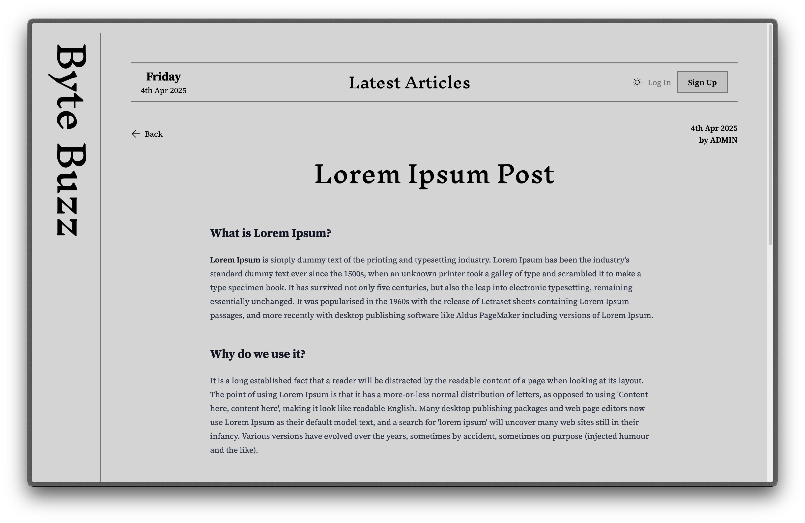

<h3 align="center">Byte Buzz Client</h3>

  

    Byte Buzz Client is frontend for the blog app. You can View all the Posts and comments made by other Authors/Users. You can also Register and login to add comments on the posts. This is created using React and Javascript with RESTful APIs created in Express server and it uses JSON Web Token for Authentication, React Router, React-Hook_Form, Zod, Axios under the hood.
     
    <a href="https://byte-buzz-client.vercel.app/" target="_blank">Live Demo</a>
  

 

<!-- ABOUT THE PROJECT -->

### Preview

 

### API

The CMS fetches data from RESTful blog API. The source code for the API can be found at <a href="https://github.com/notsanta20/byte_buzz_api" target="_blank">Byte Buzz API</a>

### CMS

The blog can be managed from the Content Management system from here <a href="https://github.com/notsanta20/byte_buzz_admin" target="_blank">Byte Buzz Admin</a>

### Built With

<!-- ACKNOWLEDGMENTS -->

## Acknowledgments

- Inspiration by <a href="https://www.theodinproject.com/lessons/node-path-nodejs-blog-api" target="_blank">The Odin Project</a>
